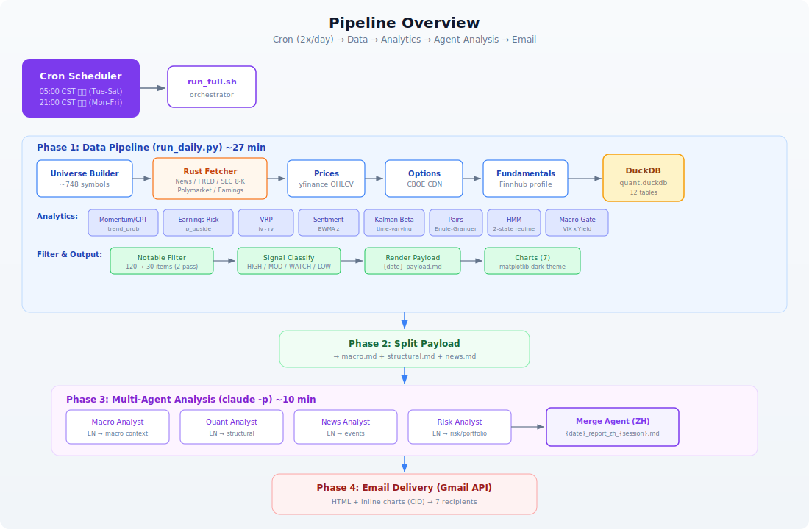
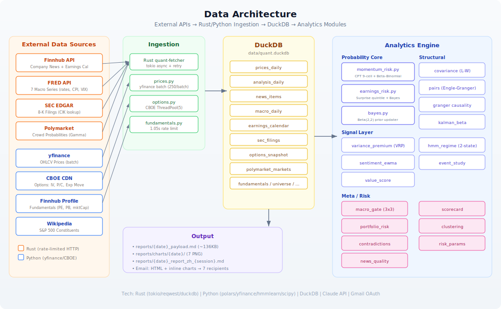
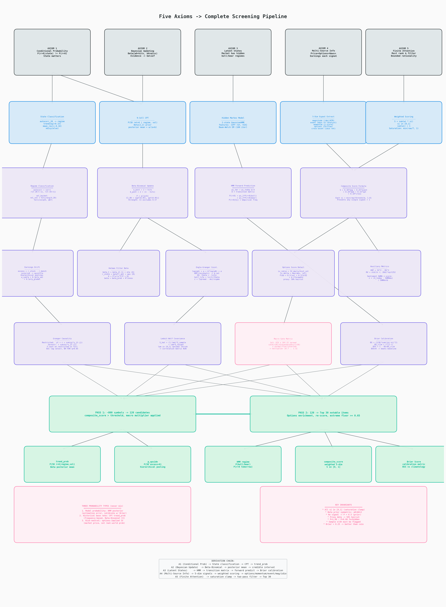
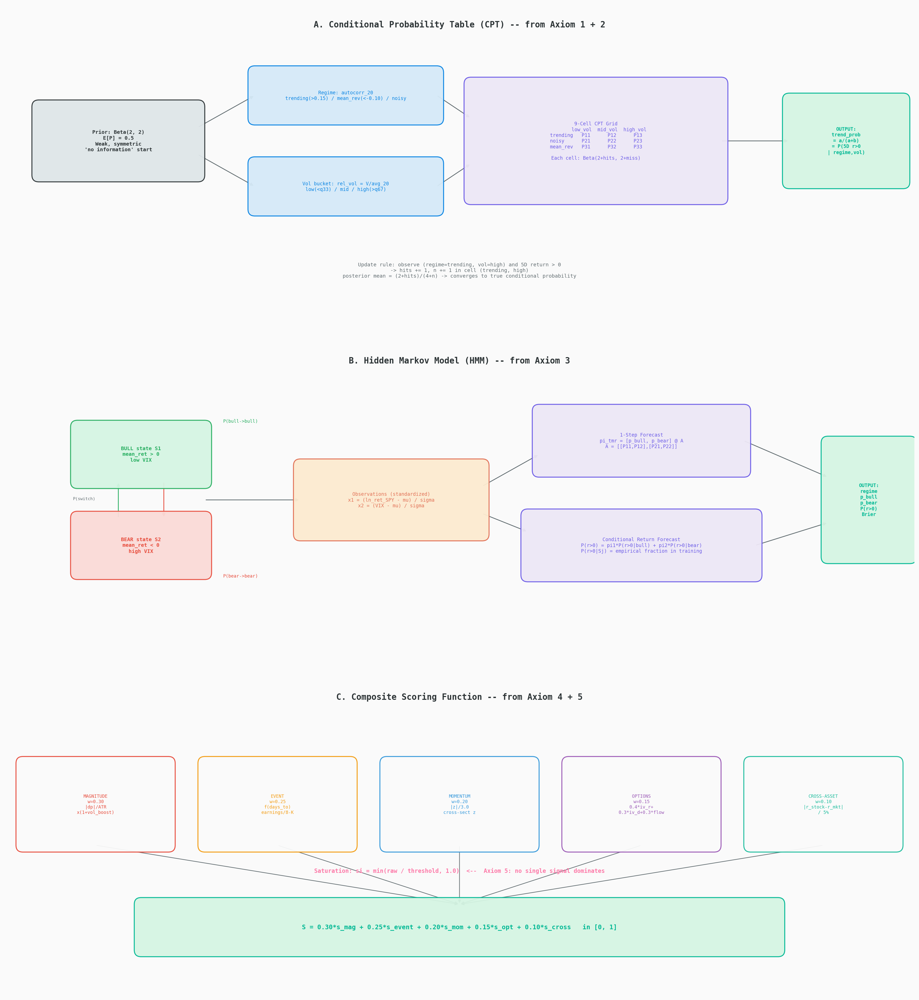
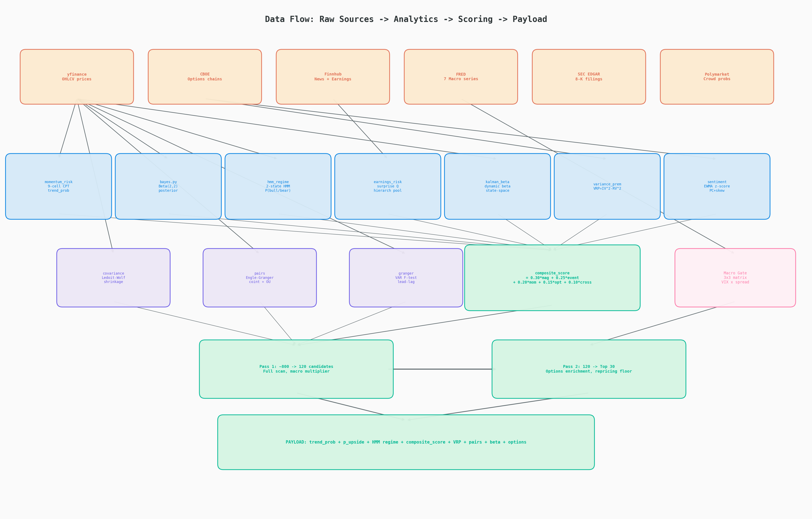

# QuantResearcher

Automated quantitative research pipeline that computes probabilities, filters notable market events, and delivers analyst-grade research reports via email — twice daily.

**Philosophy: The program computes. The agent narrates. No trading signals.**

## Architecture

### Pipeline Overview

> Cron (2x/day) → Data Ingestion → Analytics → Agent Analysis → Email



### Data Architecture

> 8 External APIs → Rust/Python Ingestion → DuckDB → 15 Analytics Modules → Markdown Payload



## How It Works

| Phase | What | Time |
|-------|------|------|
| **Data** | Universe (~748 symbols), prices, options, news, macro, filings | ~27 min |
| **Analytics** | 15 modules: CPT, Beta-Binomial, VRP, HMM, Kalman, pairs, etc. | ~1 min |
| **Filter** | 2-pass: 748 → 120 candidates → 30 notable items (HIGH/MOD/WATCH/LOW) | <1 min |
| **Agents** | 4 specialist analysts (EN) → merge into Chinese report | ~10 min |
| **Email** | HTML + inline charts → recipients | ~15 sec |

## Quick Start

```bash
# 1. Clone & configure
cp config.example.yaml config.yaml   # fill in API keys
uv sync                              # install Python deps

# 2. Build Rust fetcher
cd rust && cargo build --release && cd ..

# 3. Initialize (fetches 2yr history, ~40 min first time)
uv run python scripts/run_daily.py --init

# 4. Full pipeline (data → agents → email)
./scripts/run_full.sh

# 5. Or just regenerate analysis (skip data fetch)
./scripts/run_full.sh --skip-data
```

## Cron Schedule (UTC+8)

| Session | Time | Days | Coverage |
|---------|------|------|----------|
| Post-market | 05:00 | Tue-Sat | Previous trading day close |
| Pre-market | 21:00 | Mon-Fri | Overnight news + pre-market |

## Probability Architecture

Every output is `P(event | conditions)` with explicit horizon, conditioning set, and sample size.

| Module | Output | Method |
|--------|--------|--------|
| `momentum_risk` | `trend_prob` = P(5D return > 0 \| regime, vol_bucket) | 9-cell CPT + Beta-Binomial (Beta(2,2) prior) |
| `earnings_risk` | `p_upside` = P(5D excess > 0 \| surprise_quintile) | Beta-Binomial posterior |
| `variance_premium` | VRP = IV² - RV² | Implied vs realized variance spread |
| `sentiment_ewma` | P/C + skew EWMA z-score | Exponentially weighted anomaly |
| `hmm_regime` | P(bull), P(r>0 tomorrow), regime duration | 2-state Gaussian HMM + Brier calibration |
| `macro_gate` | Asset-class multipliers | 3×3 VIX × Yield Curve matrix |

### Mathematical Foundations

The entire screening system derives from **5 axioms**:

1. **Conditional Probability** — P(r>0 | state) ≠ P(r>0) → regime classification → 9-cell CPT
2. **Bayesian Updating** — Beta(2,2) prior → posterior mean → credible intervals
3. **Latent States** — HMM → transition matrix → forward prediction → Brier calibration
4. **Multi-Source Information** — 5-dim weighted scoring (magnitude + event + momentum + options + cross-asset)
5. **Finite Attention** — saturation clamp → two-pass filter → Top 30



### Probability Pipeline



### Data Flow



## Tech Stack

| Layer | Technology |
|-------|-----------|
| Data fetching | **Rust** (tokio, reqwest, duckdb-rs) — rate-limited async HTTP |
| Analytics | **Python** (polars, scipy, hmmlearn, statsmodels) |
| Storage | **DuckDB** — embedded OLAP, 12 tables |
| Agent analysis | **Claude** (claude -p, 4 parallel analysts + merge) |
| Email | **Gmail API** (OAuth2, HTML + CID inline charts) |
| Options data | **CBOE CDN** (delayed quotes, no API key needed) |
| Prices | **yfinance** (batch OHLCV) |

## Project Structure

```
├── CLAUDE.md              # Dev guidance for Claude Code
├── config.example.yaml    # Config template (fill API keys)
├── pyproject.toml
├── docs/                  # Design docs & architecture diagrams
│   ├── pipeline-overview.svg
│   ├── data-architecture.svg
│   ├── Agents.md          # Agent philosophy & prompt design
│   └── UPGRADE_PLAN.md    # V2 upgrade plan
├── rust/                  # Rust data fetcher (async, rate-limited)
│   └── src/
│       ├── main.rs
│       ├── fetcher/       # finnhub, fred, sec_edgar, polymarket
│       └── storage/       # duckdb bulk writes
├── scripts/               # Pipeline orchestration
│   ├── run_full.sh        # Entry point (cron target)
│   ├── run_daily.py       # Data + analytics pipeline
│   ├── run_agents.sh      # 4 analysts + merge (claude -p)
│   ├── split_payload.py   # Split payload for parallel agents
│   ├── send_report.py     # Gmail delivery
│   └── send_alert.py      # Failure alerts
├── src/quant_bot/         # Python source
│   ├── analytics/         # 15 modules (bayes, momentum, HMM, etc.)
│   ├── config/            # Settings loader
│   ├── data_ingestion/    # prices, options, fundamentals, symbols
│   ├── filtering/         # 2-pass notable item filter
│   ├── reporting/         # Payload render + charts
│   ├── screens/           # Broad screen + dividend dips
│   ├── signals/           # Classification (HIGH/MOD/WATCH/LOW)
│   ├── storage/           # DuckDB connection + schema
│   └── universe/          # S&P 500 + ETF + watchlist builder
├── data/                  # DuckDB file (gitignored)
├── logs/                  # Run logs (gitignored)
└── reports/               # Payloads, reports, charts (gitignored)
```

## Universe

- **S&P 500** — auto-fetched from Wikipedia (cached 7d)
- **Broad screen** — yfinance bulk download → top 200 movers
- **29 ETFs** — sectors (11), bonds (5), commodities (5), international (4), volatility (2), thematic (6)
- **47 watchlist** — AI/chips, space, nuclear, biotech, robotics, defense, Chinese ADRs
- **Total**: ~748 symbols after dedup

## License

Private research tool. Not for redistribution.
